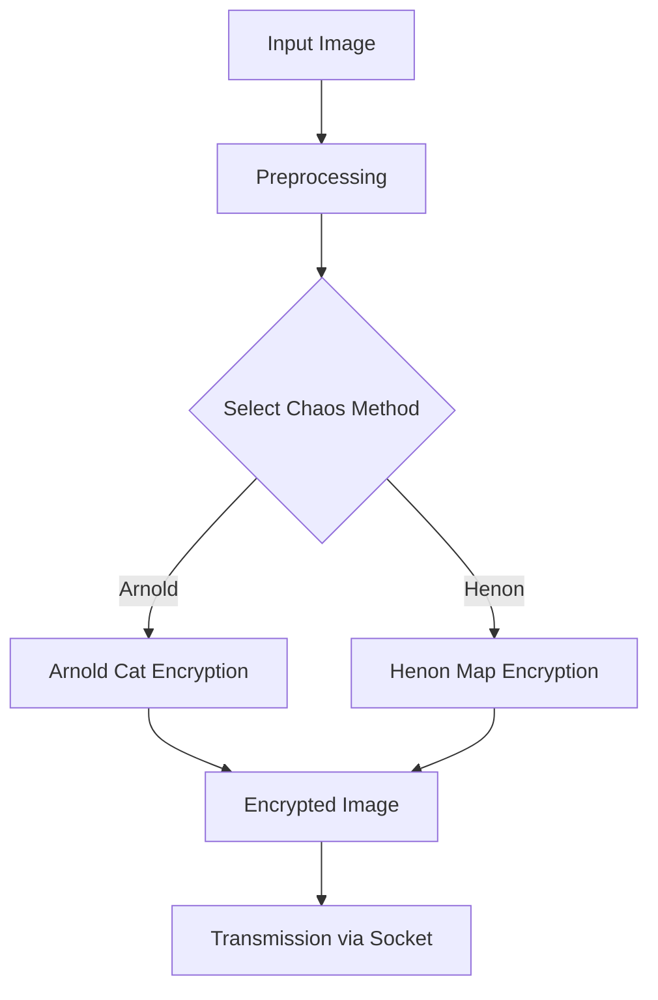

## Abstract
This project implements and analyzes two chaos-based image encryption methods—Arnold Cat Map and Henon Map Encryption—within a secure, socket-based communication framework. The aim is to enhance image security leveraging dynamical systems' pseudorandomness, and to evaluate these techniques' comparative effectiveness in security and communication scenarios relevant to computer vision and cybersecurity domains.

## Problem Statement
Conventional encryption methods may not provide sufficient robustness for image data, especially in adversarial or real-time communication environments. Chaos-based encryption leverages non-linear dynamics, offering high sensitivity to initial conditions and keys, which are valuable properties for secure image transmission and storage.

## Dataset & Preprocessing
- **Data:** Sample images in `test_images/` directory.
- **Preprocessing:** Images are normalized and reshaped as required by each encryption algorithm. Color channels are handled appropriately.

## Methodology
- **Algorithms:**
  - Arnold Cat Map Encryption
  - Henon Map Encryption
- **System Architecture:**
  - Encryption implemented in `Chaos_techniques.ipynb`
  - Client-Server communication via `client.py` and `server.py` using Python sockets
- **Evaluation Metrics:**
  - Encryption strength (histogram analysis, correlation coefficients)
  - Key sensitivity
  - Resistance to cryptanalysis

## Pipeline Diagram (mermaid)

## Experimental Setup & Challenges
- Comparative experiments on multiple test images
- Tuning iteration counts and key parameters for both algorithms
- Addressed socket reliability and data integrity issues

## Results & Comparison
| Metric               | Arnold Cat Map | Henon Map |
|----------------------|:--------------:|:---------:|
| Key Sensitivity      | High           | Very High |
| Histogram Uniformity | Moderate       | High      |
| Correlation (pixels) | Low            | Lower     |
| Speed                | Fast           | Moderate  |

## Real-World Impact
Chaos-based encryption methods are directly applicable in secure medical imaging, surveillance, and remote sensing. The socket framework enables real-time secure image transfers, a critical need in modern data-driven industries.

## Key Learnings
- Chaos theory can provide robust data security solutions
- Evaluation metrics must consider both statistical and operational aspects
- Secure communication requires careful system-level design

## References
- Fridrich, J. (1998). "Symmetric ciphers based on two-dimensional chaotic maps." International Journal of Bifurcation and chaos.
- Literature on chaos-based cryptography and secure image transmission.

---
**Project files:**
- `Chaos_techniques.ipynb` (Encryption logic)
- `client.py`, `server.py` (Socket communication)
- `test_images/` (Datasets)

---
For detailed code, refer to the notebook and scripts in this repository.
